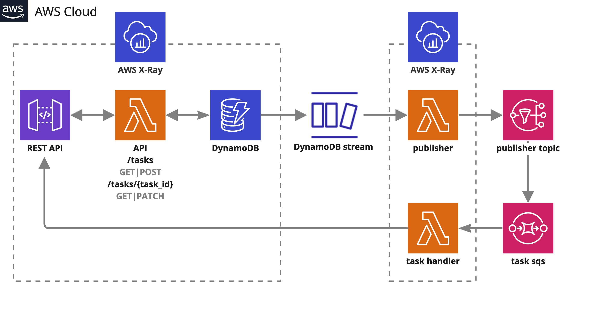
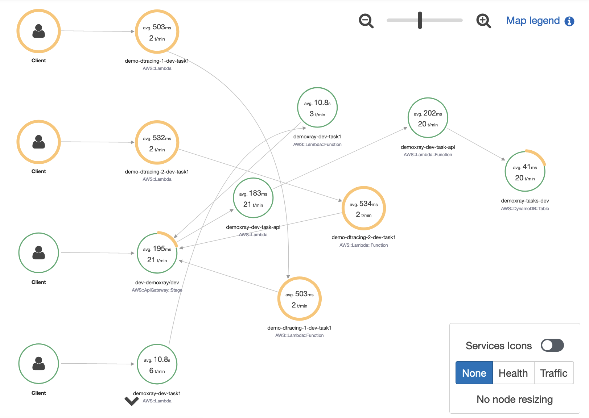

# serverless-async-app

## Overview
Asynchronous serverless task API on AWS using Lambda, DynamoDB, API Gateway, SQS, SNS and X-Ray.

The Lambda functions will be implemented in Python, and the REST API will use the FastAPI framework. The entire application will be deployed using Serverless Framework.

<p align="center">
  
</p>

Run FastAPI framework fo Python in a Lambda function behind an API Gateway using DynamoDB for storage with these routes:

- GET /tasks: Returns a list of all tasks.
- GET /tasks/{task_id}: Returns a task with the given ID.
- POST /tasks: Creates a new task.
- PATCH /tasks/{task_id}: Updates the status of a task with the given ID.

DynamoDB streams with filters together with a Lambda function to publish events to SNS.

Fan-out pattern (message-oriented middleware solutions) with SNS and SQS to distribute tasks to different handlers.

It is not possible to propagate AWS X-Ray tracing X-Amzn-Trace-Id header from one Lambda through DynamoDB stream triggered by put operation up to another Lambda, unfortunately this integration is currently impossible. There is no documentation for DynamoDB Stream, but this is the same situation: <br />
<i>It is not currently possible to connect a trace passed into an SQS queue to the Lambda consuming it on the other end. This is because although the trace header is propagated in the SQS message, you cannot set it in the Lambda because segments in Lambda are immutable.</i>

For better level of traceability of your service, for now, the only option is to use a third party service. In this example we implement New Relic.

## Prerequisites

- Python
- Serverless Framework (https://www.serverless.com/)

## Features

- Aws ApiGatewy
- Aws Lambda
- Aws DynamoDB
- Aws Sns
- Aws Sqs
- Aws X-Ray
- Python FastAPI (https://fastapi.tiangolo.com/)
- Python AWS Lambda Powertools (https://awslabs.github.io/aws-lambda-powertools-python/latest/)

## Create infrastructure

To create the infrastructure with Serverless Framework, first we should install the plugin for New Relic and then we can execute the deploy with serverless:
```
$ npm install --save-dev serverless-newrelic-lambda-layers
$ sls deploy
```

## Use the application

With all infrastructure created, try creating a few tasks through the API.
```
# Create a task with type TASK1

$ curl -X POST \
  -H "Content-Type: application/json" \
  -d '{"task_type": "TASK1", "data": {"foo": "bar"}, "ttl": "1662381756"}' \
  https://YOUR_API_URL/tasks
{
  "id": "11111111-abcd-1111-abcd-111111111111"
}
 
# List tasks. The task with type TASK1 should have status IN_PROGRESS and the other
# should still have status CREATED. If it isn't IN_PROGRESS, try again after a few seconds.
$ curl https://YOUR_API_URL/tasks
{
  "tasks": [
    {
      "id": "11111111-abcd-1111-abcd-111111111111",
      "task_type": "TASK1",
      "status": "IN_PROGRESS",
      "status_msg": "",
      "created_time": 1648229203,
      "updated_time": null
    },
    {
      "id": "22222222-abcd-2222-abcd-222222222222",
      "task_type": "TASK1",
      "status": "CREATED",
      "status_msg": "",
      "created_time": 1648229203,
      "updated_time": null
    },
  ],
  "next_token": null
}
 
# Allow 10 seconds for the task to complete and then list tasks again. The task should
# now have the status COMPLETED or FAILED.
$ curl https://YOUR_API_URL/tasks
{
  "tasks": [
    {
      "id": "11111111-abcd-1111-abcd-111111111111",
      "task_type": "TASK1",
      "status": "COMPLETED",
      "status_msg": "",
      "created_time": 1648229203,
      "updated_time": 1648229218
    },
    {
      "id": "22222222-abcd-2222-abcd-222222222222",
      "task_type": "TASK1",
      "status": "CREATED",
      "status_msg": "",
      "created_time": 1648229203,
      "updated_time": null
    },
  ],
  "next_token": null
}
```

This is a part of what we can see on Aws X-Ray (deployed same project multiple times with different names)

<p align="center">
  
</p>
